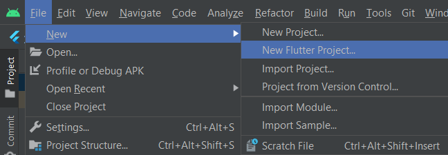
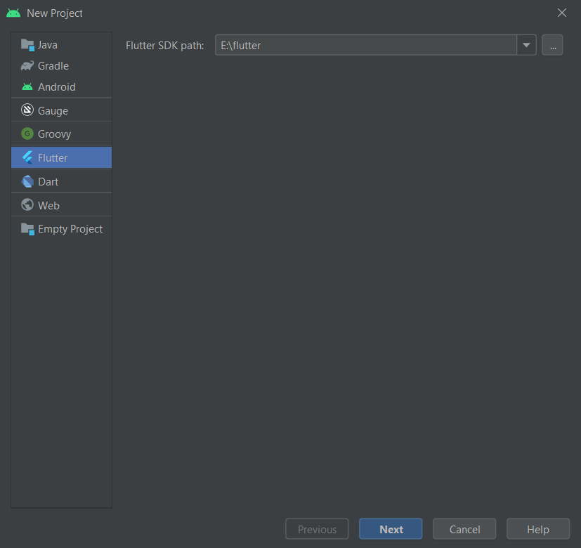
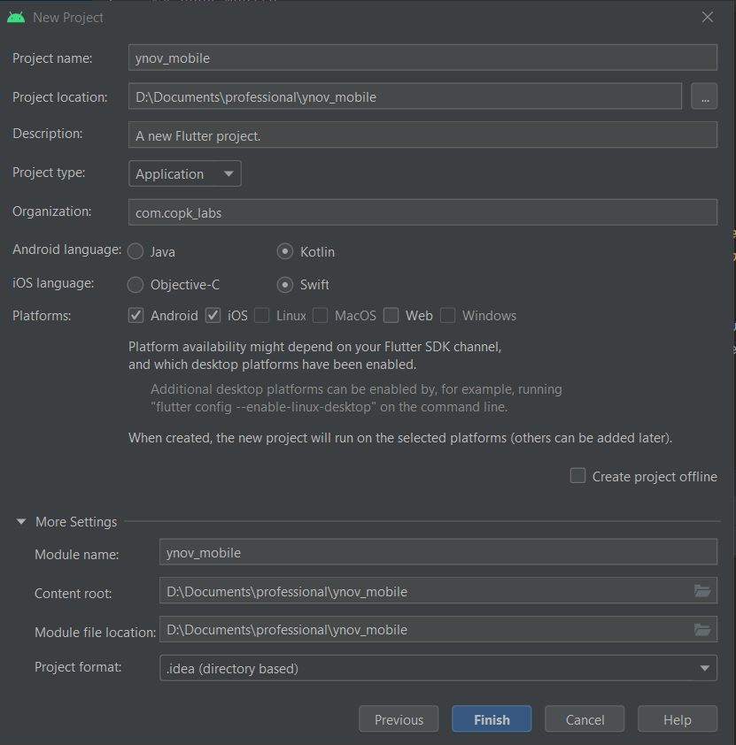

# Cours 1

## Types d'application

### Application Hybride

Une application hybride est conçue pour une utilisation sur toutes les plateformes : Android et IOS, sans différence entre les versions. Son développement est rapide et sa gestion, facile : le code source reste unique. Ce qui facilite les futures mises à jour.

Ce type d’application offre une facilité dans la maintenance parce qu’il n’y a qu’une seule version pour plusieurs plateformes. Vous économisez du temps et de l’argent... Le revers de la médaille ? Vous perdez en performance.

### Application Native

Une application native est spécifique à une plateforme Android ou iOS. Le langage de programmation est différent : Java pour Android et Swift pour iOS. Elle a l’avantage d’utiliser les fonctionnalités intégrées de l’OS.

Comparée à une version hybride, une app native s’avère plus rapide et fluide. En effet, elle s’adapte à tous les appareils, que ce soit en termes de design ou de navigation. Ce n’est pas un hasard si la majorité des applications utilisées par les mobinautes sont codées dans ce format.

Mais l’atout principal des applications natives réside dans la possibilité de créer des notifications push. Une fonctionnalité idéale pour optimiser votre stratégie marketing et commerciale !

Le seul bémol ? Les applications mobiles natives coûtent plus cher que les hybrides. Il faut en développer une pour chaque plateforme. Ce qui augmente les frais de maintenance dans le cas d’une mise à jour.

## Fluter

### Qu'est ce que Flutter ?

### Installation

#### Installation d'Android Studio

https://developer.android.com/studio

#### Installation du Sdk de Flutter

1. Il faut dans un premier temps installer le Sdk de Flutter : https://storage.googleapis.com/flutter_infra_release/releases/stable/windows/flutter_windows_2.5.3-stable.zip
2. Extrayez le fichier zip et placez le `flutter` contenu dans l'emplacement d'installation souhaité pour le SDK Flutter (par exemple, `C:\Users\<your-user-name>\Documents`).
   
   :::caution

    N'installez pas Flutter dans un répertoire tel que `C:\Program Files\` qui nécessite des privilèges élevés.

    :::

Si vous ne voulez pas installer une version fixe du bundle d'installation, vous pouvez sauter les étapes 1 et 2. Au lieu de cela, récupérez le code source à partir du dépôt Flutter sur GitHub, et modifiez les branches ou les balises si nécessaire. Par exemple :
```bash
C:\src>git clone https://github.com/flutter/flutter.git -b stable
```

4. Dans Android Studio, allez dans `Paramètres -> Plugins`, téléchargez ensuite les plugins `Dart`et `Flutter` puis redémarrez l'IDE.
5. Créez un nouveau projet Flutter
   
    * Importez le chemin du Sdk Flutter
    
    * Importez le chemin du Sdk Flutter
    