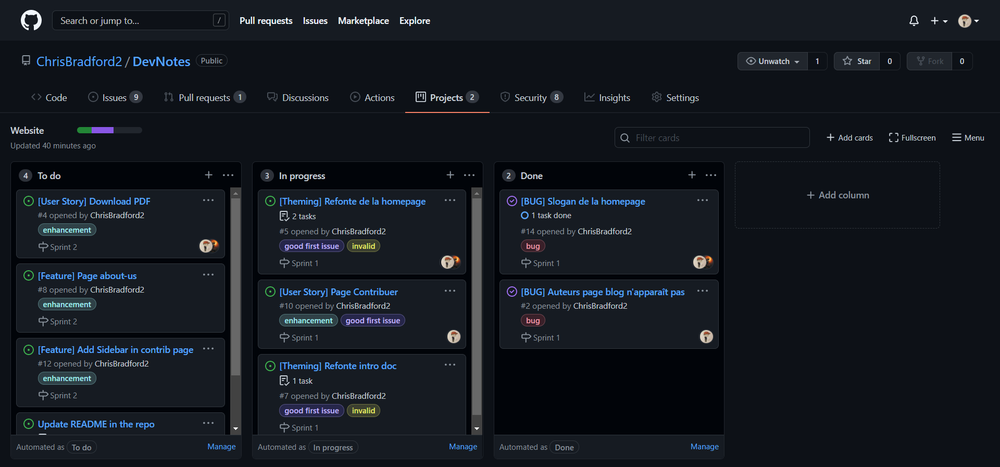

# Contribuer à DevNotes

Cette page décrit comment contribuer au wiki des **Bachelor 3 INGLOG**.

Nous encourageons toute personnes de la promo à contribuer.

Merci ! ❤️

## Avant propos

_Cette page est tirée d'une autre page Contrib qui à été traduite en français et réadaptée pour ce projet. Il se peut que certains éléments soient au mieux incohérents, au pire incompréhensibles. Si vous avez un doute sur comment contribuer ou tout autre questions, nous vous invitons à nous contacter :_
- Sur **Discord** :
  - The Senate#2279
  - NyftHeart#4154
- Sur [**GitHub Discussions**](https://github.com/ChrisBradford2/DevNotes/discussions) :
- Par mail : [devnotes@convergence-of-paprika.com](mailto:devnotes@convergence-of-paprika.com)

## Moyens de contributions 🔍

Pour contribuer au wiki des **Bachelor 3 INGLOG**, vous pouvez :

- Signaler un bug
- Suggérer de nouvelles fonctionnalités ou topic pour le wiki
- Ajouter de nouvelles fonctionnalités ou topic pour le wiki
- Ecrire du contenu pour le wiki

<br/>

## Signaler un bug :bug:

<br/>

Cette section vous guide pour signaler un bug. Suivre ces directives aide les
mainteneurs et la communauté à comprendre le bug, à reproduire le comportement
et à trouver des bugs apparentés.

### Avant de signaler un bug

Veuillez consulter la liste suivante :

- **Assurez-vous que le bug n'a pas déjà été signalé** en cherchant sur GitHub
  sous [**Issues**](https://github.com/ChrisBradford2/DevNotes/issues). Si le
  bug a déjà été signalé **et que le problème est toujours ouvert**, ajoutez un
  commentaire au problème existant au lieu d'en ouvrir un nouveau.

**Remarque:** Si vous trouvez un problème **Closed** qui semble similaire à ce
que vous rencontrez, ouvrez un nouveau ticket et incluez un lien vers le ticket
original dans le corps de votre nouveau ticket.

### Soumettre un rapport de bug.

Pour signaler un bug,
[ouvrez un nouveau ticket](https://github.com/ChrisBradford2/DevNotes/issues/new/choose),
et assurez-vous d'inclure autant de détails que possible, en utilisant la
template **Bug Report**.

**Remarque:** Les modifications mineures, comme la correction d'une Typo,
peuvent faire l'objet d'un ticket ouvert, mais n'en ont pas besoin.

Si vous voulez aussi corriger le bug, soumettez une
[pull request](#pull-requests) et référencez le ticket.

<br/>

## Suggérer une nouvelle fonctionnalité ou un nouveau sujet pour le wiki :bulb:

<br/>

Cette section vous guide pour suggérer une nouvelle fonctionnalité ou ajouter un
nouveau sujet au wiki. Le respect de ces directives permet aux mainteneurs et à
la communauté de collaborer pour trouver la meilleure façon de faire avancer
votre suggestion.

### Avant de suggérer une nouvelle fonctionnalité

**Assurez-vous que la fonctionnalité ou le sujet n'a pas déjà été suggéré.** en
cherchant sur GitHub sous
[**Issues**](https://github.com/ChrisBradford2/DevNotes/issues).

### Suggérer une nouvelle fonctionnalité ou un nouveau sujet

Pour suggérer une nouvelle fonctionnalité/un nouveau sujet,
[ouvrir un nouveau ticket](https://github.com/ChrisBradford2/DevNotes/issues/new/choose),
en utilisant la suggestion template **Feature request**.

<br/>

<!--## Ajouter une nouvelle fonctionnalité ou un nouveau sujet au wiki :hammer:

<br/>

Cette section vous guide dans l'ajout d'une nouvelle fonctionnalité ou d'un nouveau sujet. En suivant ces directives, vous donnez à votre fonctionnalité/sujet les meilleures chances d'être approuvé et fusionné.

### Avant d'ajouter une nouvelle fonctionnalité ou un nouveau sujet

Vérifiez s'il existe déjà un [ticket ouvert](https://github.com/ChrisBradford2/DevNotes/issues/) ou une [pull request (PR)](https://github.com/ChrisBradford2/DevNotes/pulls), lié à votre fonctionnalité/sujet.

Autrement, il se peut que votre fonctionnalité ne soit pas approuvée du tout.

### Ajout d'une nouvelle fonctionnalité/sujet

Pour construire une nouvelle fonctionnalité/un nouveau sujet, créez une nouvelle branche basée sur la branche `main`.

<br/>

## Pull requests :mega:

<br/>

Cette section vous guide dans la soumission d'une demande de pull request (PR). En suivant ces directives, vous donnerez à votre PR les meilleures chances d'être approuvée et fusionnée.

### Avant de soumettre une pull request

Avant de soumettre une pull request, veuillez suivre les étapes suivantes pour que votre contribution soit prise en compte par les mainteneurs :

- Les pull request doivent porter sur une seule problématique (par exemple une fonctionnalité ou un bug). Si un PR aborde plus d'un problème, il doit être divisé en deux PR ou plus ;
- Une pull request ne peut être fusionné que s'il fait référence à un ticket ouvert ;
  **Remarque :** Il n'est pas nécessaire d'ouvrir un ticket pour des modifications mineures telles que des fautes de frappe, mais vous pouvez le faire si vous le souhaitez ;
- Tout le code doit être bien testé.

### Soumettre une pull request

Voici un workflow typique pour soumettre une nouvelle pull request:

1. Fork le répo ;
2. Créez une nouvelle branche basée sur votre fork. Par exemple, `git checkout -b fix/my-fix` ou ` git checkout -b feat/my-feature` ;
3. Commitez vos changements et pushez les vers votre fork ;
4. Ciblez votre pull request pour qu'elle soit fusionnée avec `develop`

Si le mainteneur approuve le PR, il sera fusionné.

**Remarque:** Les reviewers peuvent vous demander d'effectuer des travaux supplémentaires, des tests ou d'autres modifications avant que votre pull request puisse être approuvée et fusionnée.-->

---

## Rédiger du contenu ✏️:

### Contribuer au contenu du Wiki

Ce document décrit comment contribuer et ajouter du contenu au wiki.

Nous encourageons tous ceux qui ont une connaissance dans les modules étudiés à
partager cette connaissance avec la communauté et à aider ainsi les élèves en
difficulté à mieux comprendre et à faciliter l'intégration des nouveaux élèves.

Merci! ❤️

#### Apprendre

La section Apprendre vise à décrire la plupart des fonctions de DevNotes. Le
contenu doit être expliqué de manière compréhensible pour les utilisateurs
aléatoires normaux qui n'ont pas, ou juste une petite connaissance de DevNotes.
Nous voulons accueillir les personnes intéressées et leur montrer le chemin pour
comprendre DevNotes et être fasciné par lui. L'idéal serait de pouvoir fournir
des liens vers des sources externes qui offrent un contenu plus détaillé à
différents niveaux de complexité.

<!--#### Participate

How can someone become active in the project? Where to interact with the community, how to engage with others or the technologies, and get a hands-on experience with IOTA.

Collect general info and link to Guides / POC's / Showcases / IF community sites. Create an interesting "how-to" explanation... everything that invites users: "oh yeah, I wanna do this"!

#### Develop

The gateway for Developers. Introduces the core functionalities on a more technical level and aims to bring developers directly into the correct framework for them to start working with IOTA. Also, deliver guides and tools that help to get started and to understand the concepts behind the protocol. This section will directly link to the underlying IOTA Docs and GitHub, so please provide correct links to the specific content in the IOTA Docs.-->

#### Ajouter un cours

Pour ajouter un cours au projet, vous devrez . Cela le rendra facile à utiliser
et vous pourrez écrire du contenu avec les outils connus, comme dans un word ou
un google doc. L'éditeur traduit le contenu dans un fichier **`markdown`** et
crée une Pull Request pour ajouter ce contenu dans notre dépôt GitHub. Nous
vérifions ces Pull Requests et approuvons l'ajout, ou nous vous contactons si
nous avons des suggestions pour optimiser l'article ou demander des
modifications.

Vous pouvez également créer du contenu directement dans GitHub en forkant la
branche **`main`** et commencer à éditer les pages auxquelles vous souhaitez
contribuer.

Pour éditer un document, cliquez sur le crayon (éditer ce fichier) dans le coin
supérieur droit lors de la consultation dans GitHub.

L'éditeur de GitHub s'ouvrira alors, et vous pourrez modifier votre fichier.

Toutes les pages sont thématisées et stylisées automatiquement et suivent un
format standardisé dans tout le wiki.

Le contenu de chaque page est précédé d'informations sur son contenu principal.
Ces informations indiquent au wiki ce qu'il doit savoir sur la page pour
l'ajouter au front-end au bon endroit. Ces informations n'ont pas besoin d'être
modifiées :

```yml
---
id: my-doc-id
title: My document title
description: My document description
slug: /my-custom-url
---
```

`# Header 1` – ne doit être utilisé que pour le titre/en-tête de la page en
utilisant un seul hachage

`## Header 2` – doit être utilisé pour les principales sous-sections du sujet en
utilisant un double hachage

`### Header 3` – doit être utilisé pour les sections internes de ces
sous-sections en utilisant un triple hachage

##### Contenu

Tout le contenu de la page doit être écrit en texte standard.

Un paragraphe peut être créé en laissant un double saut de ligne entre deux
blocs de texte.

##### Formatage

Utilisez un astérisque simple pour rendre un mot ou une phrase `*italique*`.

Utilisez un double astérisque pour former un mot ou une phrase `**gras**`.

Utilisez un astérisque triple pour rendre un mot ou une phrase
`***gras et italique***`.

Utilisez les doubles tilde pour `~~barrer~~` un mot ou une phrase.

##### Lien

Pour ajouter un lien à une page, nous utilisons des crochets pour contenir le
texte du lien, suivis de crochets ronds contenant l'adresse du lien :

```md
[this is a link](https://www.website.com)
```

##### Images

Pour ajouter une image à une page, nous devons d'abord télécharger la page dans
le dossier image. Ensuite, sur notre page, nous pouvons ajouter l'image en
utilisant la même méthode qu'un lien précédé d'un point d'exclamation :

```md

```

##### Image Links

Pour faire d'une image un lien, nous pouvons combiner les deux méthodes, en
plaçant le lien dans la section texte du code de l'image :

```md
[](https://example.com)
```

##### Listes

Pour créer des listes, nous utilisons deux méthodes différentes.

```md
- Bullet point
- lists
- using a hyphen
```

```md
1. Numbered
2. Lists
3. Using numbers
```

##### Quotes

```md
> To add a quoted or embedded text, we use the greater than symbol at the start
> of the section. To close off a quote we create a new paragraph.
```

##### Adding Code

Il existe deux types de saisie de code:

1.  `` `inline code` ``, qui est entouré de simples backticks.
2.  Ou les _code blocs_ avec des triples backticks :

````
```
Des blocs de code peuvent être ajoutés dans la page si nécessaire soit pour démontrer une fonction ou pour ajouter une exclamation à une section.
```
````

##### Line Divider

Nous pouvons ajouter un séparateur de ligne pour séparer la page en ajoutant 3
tirets ou 3 astérisques.

```md
---
---
```

---

##### Soumettre votre contribution

Une fois que vous avez terminé, votre contribution se trouve en bas de la page
d'édition, dans la section de validation des modifications.

- Dans le titre, ajoutez le titre de la page que vous avez modifiée.
- Nom de la page éditée.md
- Dans la description, expliquez brièvement vos modifications, qu'il s'agisse de
  la correction d'un fait ou d'une faute de frappe, de la création d'une page
  complète, de son formatage, etc.
- Sélectionnez créer une nouvelle branche
- Nommez la branche d'après votre nom - pagename-edit
- Cliquez sur commettre les changements
- Cela ouvrira une demande de retrait, où vous pourrez remplir les informations
  de base pour vos mises à jour.
- Cliquez ensuite sur le bouton `create pull request`.

##### Travailler avec le Project Board

Afin de garder le projet DevNotes organisé et d'aider tout le monde à comprendre
l'état actuel du travail en cours, nous avons décidé d'utiliser un tableau de
projet de style Kanban. Tout ce qui concerne la création de contenu doit être
représenté dans ce tableau. Vous le trouverez sous l'onglet projets :

https://github.com/ChrisBradford2/DevNotes/projects/3



Dans le tableau, nous avons créé 5 champs qui représentent le cycle de vie d'une
page de contenu jusqu'à son achèvement. **To do**

Voici toutes les pages sur lesquelles vous n'avez pas encore commencé à
travailler. Choisissez ici la carte de la page de contenu que vous souhaitez
créer et passez à l'étape suivante en la faisant glisser dans le dossier de la
page.

**In progress**

Contenu sur lequel quelqu'un est en train de travailler. Tant que vous
travaillez et modifiez une page, laissez la carte ici.

**Ready for Review**

Dès que vous souhaitez recevoir une review de votre travail, déplacez la carte
ici et ouvrez une pull request.

**Reviewer approved**

Le contenu écrit est peut-être terminé, mais les graphiques, les images ou les
liens vers des contenus extérieurs ou d'autres pages doivent peut-être encore
être corrigés ou complétés.

**Done**

Les pages de contenu ont été finalisées et sont prêtes à être publiées, Pull
Request fermée. La page peut être ajoutée "telle quelle" dans la version finale
du Wiki.


**Convert to issue**

Chaque carte du Kanban peut être convertie en un ticket ouvert. Vous devriez
utiliser cette fonction. Nous pouvons tous travailler beaucoup mieux si nous
voyons quels tickets sont actuellement ouverts et lesquels sont fermés, et cela
nous aide à rester organisés.


##### Utilisation des tickets pour organiser le déroulement du projet

Une fois que vous avez converti votre carte du tableau de bord du projet en un
problème ouvert, vous pouvez ajouter certains attributs au problème qui
structureront notre flux de travail.


**Assignees**

You can assign an issue to yourself if you are working alone on your content, or
to another member of the Team that you think can help or needs to have a look at
that issue


**Labels**

Les étiquettes sont un excellent outil pour visualiser un ticket. Elles
apparaissent dans la vue d'ensemble principale des problèmes et indiquent
directement l'objet du problème. Pour le contenu, nous utilisons l'étiquette
"Cours".

-->

**Projects**

Vous pouvez ici affecter un ticket à un projet.


**Milestones**

Les Milestones peuvent vous aider à voir si des progrès importants ont été
réalisés. Vous êtes libre d'ajouter des jalons que vous jugez importants.


**Linked Pull Requests**

Dès que vous avez ouvert une pull request pour le contenu, liez le ticket à
cette pull request. Lorsque la pull request sera fusionnée ou fermée, ce ticket
sera automatiquement fermée.


## Félicitations ! Vous avez terminé !

Bonne contribution et si vous avez des questions ou des idées, envoyez-nous un
ticket !
